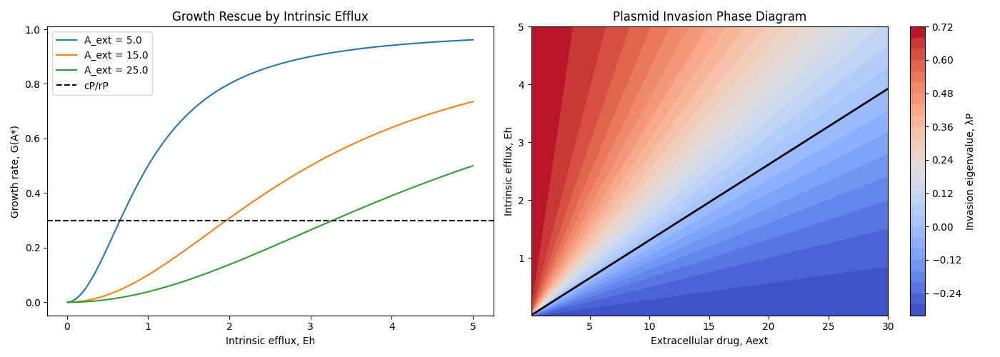
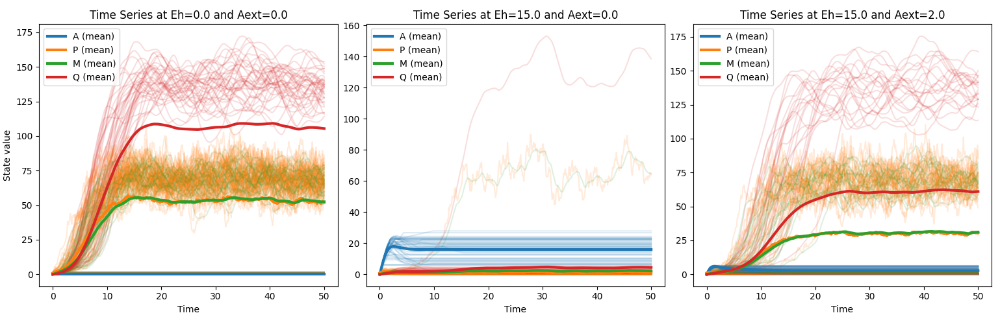

# Intracellular Plasmid-Mediated Antimicrobial Resistance Dynamics

## Overview

Antimicrobial resistance is commonly treated as a binary cellular trait, classifying cells as either resistant or sensitive. In contrast, this project models resistance as an emergent, time-dependent intracellular phenotype arising from feedback between antimicrobial accumulation, host growth, plasmid copy-number dynamics, and delayed expression of plasmid-encoded efflux pumps.

The central question addressed is:
```
Can weak intrinsic host efflux activity sustain sufficient growth under antimicrobial pressure to permit plasmid copy-number amplification and delayed expression of plasmid-encoded efflux pumps, ultimately leading to full resistance, even when plasmid-encoded resistance alone is initially insufficient?
```

To answer this, the project implements:
- A deterministic intracellular ODE model
- A hybrid stochastic–deterministic PDMP (piecewise-deterministic Markov process)

Both frameworks track intracellular antimicrobial concentration, plasmid copy number, efflux gene expression, and growth inhibition. Resistance emerges as a race between antimicrobial toxicity and plasmid-driven efflux expression, rather than as a fixed genetic trait.

---

## Project Structure

```
├── main.py
├── parameters/
│   ├── params.json
├── ode_model/
│   ├── model.py
│   ├── charts.py
│   └── figures/
├── ssa_model/
│   ├── model.py
│   ├── charts.py
│   └── figures/
├── docs/
│   ├── appendix_A.pdf
│   ├── appendix_B.pdf
│   └── appendix_C.pdf
├── requirements.txt
└── README.md
```

---

## Installation

Prerequisites:
- Python 3.8 or higher
- NumPy
- SciPy
- Matplotlib

1. Close the repository:

```bash
git clone https://github.com/heitor-sg5/efflux_dynamics/.git
cd intracellular-amr-dynamics
```

2. Install Python dependencies:

```bash
pip install -r requirements.txt
```

---

## Usage

Run the program from the project root:

```bash
python main.py
```

This will:

1. load the parameters from `parameters/params.json`
2. Run deterministic intracellular ODE simulations
3. Perform intrinsic efflux parameter sweeps
4. Compute plasmid invasion eigenvalues
5. Generate and save figures to `ode_model/figures`

To run the stochastic hybrid PDMP (SSA) simulations:

```bash
python main.py --ssa
```

Custom options include:

```bash
python main.py --ssa --runs 100 --TMAX 50
```

Available command-line options:

- `--params`: path to parameter JSON file
- `--TMAX`: maximum simulation time
- `--ode`: run deterministic ODE model
- `--ssa`: run stochastic PDMP model
- `--runs`: number of stochastic realizations

---

## Output

The following figures and conclusions were made:


### Figure 1: Intracellular time-series dynamics under different antimicrobial and efflux scenarios.
Time-series solutions of the deterministic ODE model over 50 time units.
Left: No antimicrobial exposure. Plasmid copy number rapidly invades despite imposing a fitness cost, equilibrating with mRNA and efflux protein levels and producing large amounts of efflux protein.
Middle: External antimicrobial concentration of 15 with no intrinsic host efflux activity. Plasmids fail to invade, efflux proteins are not expressed, intracellular antimicrobial concentration increases sharply, and growth collapses. The critical intrinsic efflux threshold in this scenario is 1.96, which is not met.
Right: Identical antimicrobial exposure with intrinsic host efflux activity of 2. Initial drug accumulation is slowed sufficiently to permit plasmid amplification beyond a threshold copy number, leading to delayed efflux protein expression, clearance of intracellular drug, and full resistance. Final plasmid, mRNA, and protein levels closely match the no-drug case.



### Figure 2: Growth bifurcation and plasmid invasion thresholds.
Left: Growth rate as a function of intrinsic host efflux activity under three extracellular antimicrobial concentrations (5, 15, 25). Each curve exhibits a rectangular-hyperbola shape, with increasing antimicrobial levels shifting the curve rightward and reducing maximal growth.
Right: Phase diagram of intrinsic efflux activity versus extracellular antimicrobial concentration, shaded by the plasmid invasion eigenvalue. Higher intrinsic efflux activity strongly promotes plasmid invasion, while increasing antimicrobial concentration suppresses invasion. Both parameters exhibit an approximately linear trade-off, with intrinsic efflux activity exerting the dominant effect.



### Figure 3: Hybrid stochastic–deterministic PDMP simulations.
Time series from 50 stochastic realizations under the same conditions as the deterministic model.
Left: No antimicrobial exposure. Plasmid extinction probability is 0.22, with invasion occurring in 78% of runs, closely matching deterministic behavior.
Middle: Antimicrobial concentration of 15 with no intrinsic efflux. Plasmid extinction probability rises to 0.98, with resistance emerging in only 2% of realizations.
Right: Antimicrobial exposure with intrinsic efflux activity present. Despite deterministic invasion, plasmid extinction occurs in 56% of runs, with successful invasion in 44%. This highlights the strong role of stochastic timing: plasmids that amplify before antimicrobial toxicity dominates are more likely to establish resistance.

---

## Documentation

- Appendix A `docs/appendix_A.pdf`: Biological motivation, model assumptions, state variables, and full ODE system
- Appendix B `docs/appendix_B.pdf`: Plasmid-free equilibrium, Jacobian analysis, and analytical invasion thresholds
- Appendix C `docs/appendix_C.pdf`: Hybrid stochastic–deterministic PDMP formulation and Gillespie-type simulation algorithm

---

## References

- Hernández-Beltrán, J.C.R., San Millán, A., Fuentes-Hernández, A. and Peña-Miller, R. (2021). Mathematical Models of Plasmid Population Dynamics. Frontiers in Microbiology, 12. Available at: https://pmc.ncbi.nlm.nih.gov/articles/PMC8600371/ 

- Nolivos, S., Cayron, J., Dedieu, A., Page, A., Delolme, F. and Lesterlin, C. (2019). Role of AcrAB-TolC multidrug efflux pump in drug-resistance acquisition by plasmid transfer. Science, 364(6442), pp.778–782. Available at: https://www.science.org/doi/10.1126/science.aav6390

- Povolo, V.R. and Ackermann, M. (2019). Disseminating antibiotic resistance during treatment. Science, 364(6442), pp.737–738. Available at:  https://www.science.org/doi/10.1126/science.aax6620 

- Li, X.-Z., Plésiat, P. and Nikaido, H. (2015). The Challenge of Efflux-Mediated Antibiotic Resistance in Gram-Negative Bacteria. Clinical Microbiology Reviews, 28(2), pp.337–418. Available at: https://pmc.ncbi.nlm.nih.gov/articles/PMC4402952/
